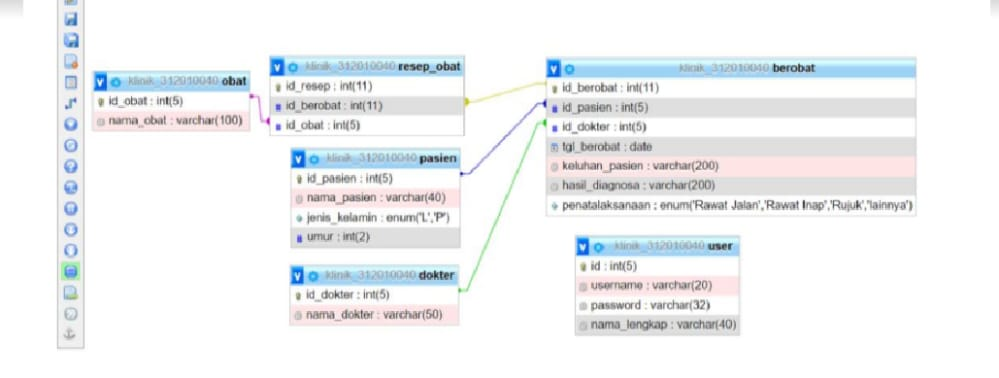
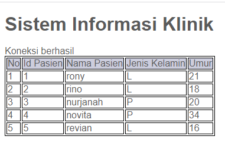
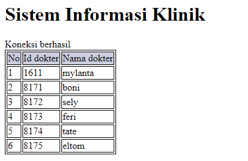
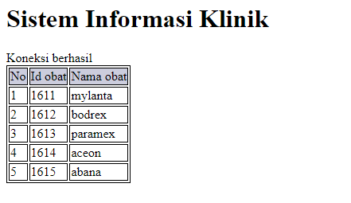
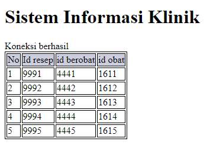
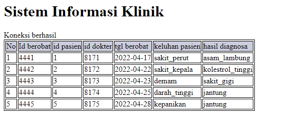
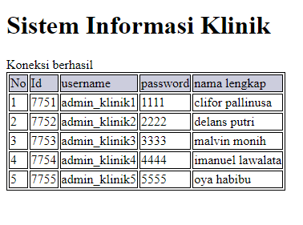

# TUGAS-5
## Nama : Rony Eltom Atibaman
## NIM : 312010003
## Kelas : TI.20.D.1
## Matkul : Sistem basis data

### membuat sebuah database seperti gambar di bawah ini:<br>
<br>

## membuat file `koneksi.php` untuk menghubungkan file databasennya
```
<?php
$host = "localhost";
$user = "admin_klinik";
$pass = "312010003";
$db = "klinik_312010003";

$conn = mysqli_connect($host, $user, $pass, $db);
if ($conn == false)
{
    echo "Koneksi ke server gagal.";
    die();
} else echo "Koneksi berhasil";
?>
```
> hasil browser


### membuat file `pasien.php`
```
<!DOCTYPE html>
<html>
<head>
    <title>Menampilkan Data Dari Database PHP </title>
    <style>
        table,tr,td {
            border: 1px solid black;
        }
        thead {
            background-color: #cccddd;
        }
    </style>
</head>
<body>
    <h1 style>Sistem Informasi Klinik</h1>
    <table>
        <thead>
            <tr>
                <td>No</td>
				<td>Id Pasien</td>
                <td>Nama Pasien</td>
                <td>Jenis Kelamin</td>
                <td>Umur</td>                
            </tr>
        </thead>
        <?php
        include "koneksi.php";
        $no = 1;
        $query = mysqli_query($conn, 'SELECT * FROM pasien');
        while ($data = mysqli_fetch_array($query)) {
        ?>
            <tr>
                <td><?php echo $no++ ?></td>
				<td><?php echo $data['id_pasien'] ?></td>
                <td><?php echo $data['nama_pasien'] ?></td>
                <td><?php echo $data['jenis_kelamin'] ?></td>
                <td><?php echo $data['umur'] ?></td>
            </tr>
        <?php } ?>
    </table>
</body>
<style css>
{
        margin: 0;
        padding: 0;
    }
    body {
        line-height:1;
        font-size:100%;
        font-family:'Open Sans', sans-serif;
        color:#5a5a5a;
    }
    #container {
        width: 980px;
        margin: 0 auto;
        box-shadow: 0 0 1em #cccccc;
    }
    /* header */
    header {
        padding: 20px;
    }
    header h1 {
        margin: 20px 10px;
        color: #b5b5b5;
    }
    </style>
```
> Hasil Browser <br>


### membuat file `dokter.php`
```
<!DOCTYPE html>
<html>
<head>
    <title>Menampilkan Data Dari Database PHP </title>
    <style>
        table,tr,td {
            border: 1px solid black;
        }
        thead {
            background-color: #cccddd;
        }
    </style>
</head>
<body>
    <h1 style>Sistem Informasi Klinik</h1>
    <table>
        <thead>
            <tr>
                <td>No</td>
				<td>Id dokter</td>
                <td>Nama dokter</td>                
            </tr>
        </thead>
        <?php
        include "koneksi.php";
        $no = 1;
        $query = mysqli_query($conn, 'SELECT * FROM dokter');
        while ($data = mysqli_fetch_array($query)) {
        ?>
            <tr>
                <td><?php echo $no++ ?></td>
				<td><?php echo $data['id_dokter'] ?></td>
                <td><?php echo $data['nama_dokter'] ?></td>
            </tr>
        <?php } ?>
    </table>
</body>
```
> hasil browser <br>


### membuat file `obat.php`.
```
<!DOCTYPE html>
<html>
<head>
    <title>Menampilkan Data Dari Database PHP </title>
    <style>
        table,tr,td {
            border: 1px solid black;
        }
        thead {
            background-color: #cccddd;
        }
    </style>
</head>
<body>
    <h1 style>Sistem Informasi Klinik</h1>
    <table>
        <thead>
            <tr>
                <td>No</td>
				<td>Id obat</td>
                <td>Nama obat</td>              
            </tr>
        </thead>
        <?php
        include "koneksi.php";
        $no = 1;
        $query = mysqli_query($conn, 'SELECT * FROM obat');
        while ($data = mysqli_fetch_array($query)) {
        ?>
            <tr>
                <td><?php echo $no++ ?></td>
				<td><?php echo $data['id_obat'] ?></td>
                <td><?php echo $data['nama_obat'] ?></td>
            </tr>
        <?php } ?>
    </table>
</body>
```
> hasil browser<br>


### membuat file `resep_obat.php`.
```
<!DOCTYPE html>
<html>
<head>
    <title>Menampilkan Data Dari Database PHP </title>
    <style>
        table,tr,td {
            border: 1px solid black;
        }
        thead {
            background-color: #cccddd;
        }
    </style>
</head>
<body>
    <h1 style>Sistem Informasi Klinik</h1>
    <table>
        <thead>
            <tr>
                <td>No</td>
				<td>Id resep</td>
                <td>id berobat</td>  
                <td>id obat</td>                
            </tr>
        </thead>
        <?php
        include "koneksi.php";
        $no = 1;
        $query = mysqli_query($conn, 'SELECT * FROM resep_obat');
        while ($data = mysqli_fetch_array($query)) {
        ?>
            <tr>
                <td><?php echo $no++ ?></td>
				<td><?php echo $data['id_resep'] ?></td>
                <td><?php echo $data['id_berobat'] ?></td>
                <td><?php echo $data['id_obat'] ?></td>
            </tr>
        <?php } ?>
    </table>
</body>
```
> hasil browser<br>


### membuat file `berobat`.
```
<!DOCTYPE html>
<html>
<head>
    <title>Menampilkan Data Dari Database PHP </title>
    <style>
        table,tr,td {
            border: 1px solid black;
        }
        thead {
            background-color: #cccddd;
        }
    </style>
</head>
<body>
    <h1 style>Sistem Informasi Klinik</h1>
    <table>
        <thead>
            <tr>
                <td>No</td>
				<td>Id berobat</td>
                <td>id pasien</td>
                <td>id dokter</td>
                <td>tgl berobat</td>
                <td>keluhan pasien</td>
                <td>hasil diagnosa</td>             
            </tr>
        </thead>
        <?php
        include "koneksi.php";
        $no = 1;
        $query = mysqli_query($conn, 'SELECT * FROM berobat');
        while ($data = mysqli_fetch_array($query)) {
        ?>
            <tr>
                <td><?php echo $no++ ?></td>
				<td><?php echo $data['id_berobat'] ?></td>
                <td><?php echo $data['id_pasien'] ?></td>
                <td><?php echo $data['id_dokter'] ?></td>
                <td><?php echo $data['tgl_berobat'] ?></td>
                <td><?php echo $data['keluhan_pasien'] ?></td>
                <td><?php echo $data['hasil_diagnosa'] ?></td>
            </tr>
        <?php } ?>
    </table>
</body>
```
> hasil browser<br>


### membuat file `user.php`.


<h1>TERIMA KASIH</h1>